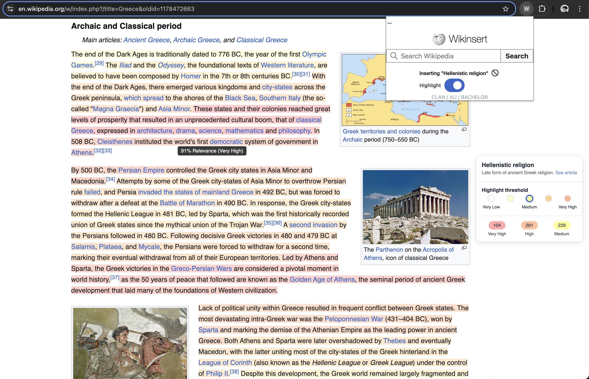
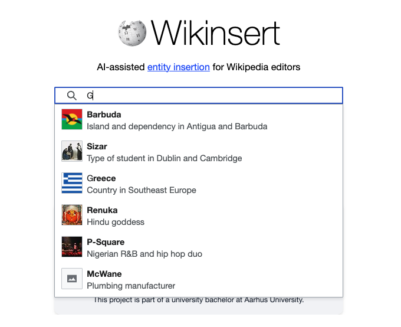

# Wikinsert: Entity-Aware Highlighting for Wikipedia

Wikinsert is a system for generating and displaying entity-aware highlighting of Wikipedia articles. It helps users
identify sentences in a source article that are relevant to a specific target entity, enabling more efficient
information discovery and knowledge integration.



## System Architecture

Wikinsert is composed of three main layers:

1. **Data Processing Layer** - Generates relevance scores for target entities
2. **Backend API Layer** - Stores and serves those scores
3. **UI Layer** - Overlays scores onto Wikipedia articles for interactive inspection

The overall architecture is illustrated below:


### Components

- **[Data Layer (scripts)](scripts/README.md)**: Python scripts that process Wikipedia articles, tokenize sentences, and
  compute relevance scores using the XLocEI model.
- **[Backend API (backend)](backend/README.md)**: Kotlin/Ktor server that provides endpoints for retrieving heatmap data
  and searching for target entities.
- **[Browser Extension (extension)](extension/README.md)**: TypeScript/Vue.js browser extension that overlays
  highlighting on Wikipedia articles.
- **[Web App (web)](web/README.md)**: Vue.js web application that serves as an entry point for user study experiments.

## Deployment

Wikinsert is designed to be deployed using Docker Compose, which orchestrates the following services:

1. **MongoDB**: Stores pre-computed article data, sentence tokenization, and relevance scores
2. **Python Populator**: Processes Wikipedia articles and populates the MongoDB database
3. **Ktor API**: Serves pre-computed data to the UI layer

### Prerequisites
- Docker and Docker Compose
- Access to Wikipedia dump data (for the Python populator) (behind VPN of AU)
- Environment variables configuration
- Access to the XLocEI model files (behind VPN of AU)

### Environment Variables

The following environment variables are configured in `docker-compose.yml` file, this gives you flexibility, one could also use a `.env` file to set these variables, however since we are dockerizing the application, we will hardcode them in the `docker-compose.yml` file. :

```
SOURCE_ARTICLES_PATH=/path/to/revisions_en.parquet
SCORED_DATA_PATH=/path/to/en_5_scored.parquet
MENTION_MAP_PATH=/path/to/mention_map_en.parquet
MODEL_DIR=/path/to/models
```

Note that `SOURCE_ARTICLES` are the raw Wikipedia articles, and `SCORED_DATA` includes a sample that has been paired with target entities, so in practice, you would only need the pairs, however for some experiments, you might want to use the raw articles as well. The `MENTION_MAP` is a mapping of mentions to entities, and `MODEL_DIR` is the directory where the XLocEI model is stored.

### Deployment Steps

1. **Clone the repository**:
   ```bash
   git clone https://github.com/your-username/wikinsert-au.git
   cd wikinsert-au
   ```

2. **Configure environment variables**:
   Create a `.env` file or directly hardcode it in the `.yml` file for docker-compose in the root directory with the
   required variables.

3. **Start the MongoDB service**:
   ```bash
   docker-compose up -d mongodb
   ```

4. **Populate the database** (one-time operation):
   ```bash
   docker-compose --profile populator up python-populator
   ```

5. **Start the API service**:
   ```bash
   docker-compose --profile api up -d ktor-api
   ```

6. **Install the browser extension**:
   Follow the instructions in the [extension README](extension/README.md) to build and install the browser extension.

### Docker Compose Configuration

The `docker-compose.yml` file defines three services:

1. **mongodb**: MongoDB database server
    - Exposes port 27017
    - Persists data in a volume

2. **python-populator**: Data processing and database population
    - Mounts data volumes and environment variables
    - Depends on MongoDB being healthy
    - Uses the "populator" profile

3. **ktor-api**: Backend API server
    - Exposes port 8081
    - Connects to MongoDB
    - Uses the "api" profile

## Usage

**Browser Extension**:
    - Navigate to a Wikipedia article you have computed relevance scores for
    - Click the Wikinsert extension icon
    - Search for a target entity (which should be in the preprocessed dataset)
    - Toggle highlighting to see the heatmap overlay

**Web App**:
This is a way of searching through your preprocessed dataset, and viewing the articles that can be highlighted, withouth directly going to the URL of the article. Helps with workflow simulation and user studies.
    - Start the web app using `npm run dev`
    - Access the web app URL at `http://localhost:8080`
    - Search for a Wikipedia article from the preprocessed dataset
    - Then use the browser extension to highlight entities in the article

## Search Interface

The search interface allows users to find target entities related to the current Wikipedia article:



## Development

For development instructions, refer to the README files of individual components:

- [Data Layer Development](scripts/README.md)
- [Backend API Development](backend/README.md)
- [Browser Extension Development](extension/README.md)
- [Web App Development](web/README.md)
