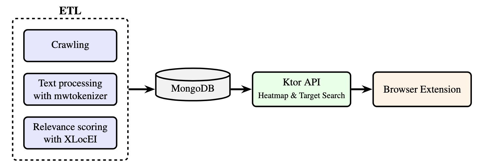

# WIKINSERT: A Multilingual Machine-in-the-Loop Entity Insertion System for Wikipedia

Wikinsert is a system for generating and displaying entity-aware highlighting of Wikipedia articles. It helps users
identify sentences in a source article that are relevant to a specific target entity, enabling more efficient
information discovery and knowledge integration.

## Video demonstration of Wikinsert

<video width="100%" height="auto" controls>
  <source src="static/demo-vid.mp4" type="video/mp4">
  Your browser does not support the video tag.
</video>

If the embedded player does not appear, you can download or open the video directly:

[Download the demo video](static/demo-vid.mp4)


## Downloading the extension

1. Navigate to <https://github.com/au-clan/wikinsert/releases>.
2. Open the **latest release** (or **pre‑release**) entry.
3. Under **Assets**, download **wikinsert‑extension.zip**.

After downloading, continue with the installation steps below.

## Installing the Wikinsert browser extension

### Quick install (Chrome / Brave / Edge)
1. Download `wikinsert-extension.zip` from the “Assets” section below.
2. Unzip it – you’ll see a folder that contains **dist/**.
3. Open your browser and navigate to:
   * `chrome://extensions`  (Chrome)  
   * `brave://extensions`   (Brave)  
   * `edge://extensions`    (Edge)
4. Enable **Developer mode** (toggle in the upper-right).
5. Click **Load unpacked**, select the `dist` folder and confirm.
6. Pin the “Wikinsert” icon to your toolbar for easy access.

### Quick install (Firefox – temporary)
1. Unzip the archive.
2. Visit `about:debugging#/runtime/this-firefox`.
3. Click **Load Temporary Add-on…** and pick `dist/manifest.json`.
   * Firefox removes temporary add-ons on restart; for a persistent install we’ll need AMO signing.

> **DISCLAIMER**  
> The Wikinsert API and MongoDB database are currently hosted on Aarhus University servers that require a VPN connection.  
> If you are not connected to the AU VPN the extension will still load, but **it will not be able to retrieve heat‑map data**.  
> We will migrate the service to a publicly accessible server before our EMNLP demonstration.
## Usage

**Browser Extension**:
- Navigate to a Wikipedia article you have computed relevance scores for
- Click the Wikinsert extension icon
- Search for a target entity (which should be in the preprocessed dataset)
- Toggle highlighting to see the heatmap overlay

**Web App**:
This is a way of searching through your preprocessed dataset, and viewing the articles that can be highlighted, withouth directly going to the URL of the article. Helps with workflow simulation and user studies.
- cd into the `web` directory
- Install dependencies using `npm install`
- Start the web app using `npm run dev`
- Access the web app URL at `http://localhost:8080`
- Search for a Wikipedia article from the preprocessed dataset
- Then use the browser extension to highlight entities in the article

## Development

For development instructions, refer to the README files of individual components:

- [Data Layer Development](scripts/README.md)
- [Backend API Development](backend/README.md)
- [Browser Extension Development](extension/README.md)
- [Web App Development](web/README.md)


### System Architecture

Wikinsert is composed of three main layers:

1. **Data Processing Layer** - Generates relevance scores for target entities
2. **Backend API Layer** - Stores and serves those scores
3. **UI Layer** - Overlays scores onto Wikipedia articles for interactive inspection

The overall architecture is illustrated below:



### Components

- **[Data Layer (scripts)](scripts/README.md)**: Python scripts that process Wikipedia articles, tokenize sentences, and
  compute relevance scores using the XLocEI model.
- **[Backend API (backend)](backend/README.md)**: Kotlin/Ktor server that provides endpoints for retrieving heatmap data
  and searching for target entities.
- **[Browser Extension (extension)](extension/README.md)**: TypeScript/Vue.js browser extension that overlays
  highlighting on Wikipedia articles.
- **[Web App (web)](web/README.md)**: Vue.js web application that serves as an entry point for user study experiments.

### Serving the Wikinsert API and Database (behind VPN of Aarhus University)
You interact with the stack exclusively through `run-wikinsert.sh`.  

#### Prerequisites
- Docker and Docker Compose
- Access to Wikipedia dump data (for the Python populator) (behind VPN of AU)
- Access to the XLocEI model files (behind VPN of AU)

Pick the workflow that matches what you need:

#### 1  Populate the database only
Use this when you want to load several different samples before exposing an API.
```bash
./run-wikinsert.sh --populate \
  --source /path/to/revisions_en.parquet \
  --scored /path/to/en_5_scored.parquet \
  --mention /path/to/mention_map_en.parquet \
  --model-dir /path/to/models
```
#### 2  Populate the database **and** start the API in one go

```bash
./run-wikinsert.sh --all \
  --source /path/to/revisions_en.parquet \
  --scored /path/to/en_5_scored.parquet \
  --mention /path/to/mention_map_en.parquet \
  --model-dir /path/to/models
```

If the database is already populated and you only want to expose the API, run:

```bash
./run-wikinsert.sh --api
```


### Deployment Steps

1. **Clone the repository**
   ```bash
   git clone https://github.com/au-clan/wikinsert
   cd wikinsert
   ```

2. **Configure MongoDB connection**  
   Open **docker-compose.yml** and edit the two environment variables under the **ktor-api** service:

   ```yaml
   environment:
     - MONGODB_URI=mongodb://localhost:27017/
     - MONGODB_DATABASE=wikinsert
   ```

3. **Start services**
   Use the `run-wikinsert.sh` script as described above to start the desired services.

**Note:** MongoDB connection settings (`MONGODB_URI`, `MONGODB_DATABASE`) are set in `docker-compose.yml` for now; all other paths are supplied via command‑line flags.
