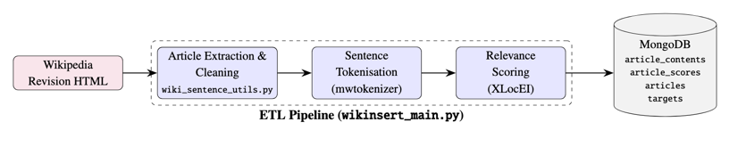

# Wikinsert Data Layer

This directory contains the data processing pipeline for Wikinsert, which transforms raw Wikipedia HTML into a
structured, queryable store of sentence-level relevance scores. The processed dataset is static and limited to a
predefined sample of articles, selected for their known entity insertions.

## Usage

The pipeline is implemented in `wikinsert_main.py` and can be run with, this will run a full ETL process to populate the
MongoDB database with processed data:

```bash
python3 wikinsert_main.py
```

### Configuration

The pipeline uses environment variables for configuration:

- `MONGO_URI`: MongoDB connection string (default: "mongodb://localhost:27017/")
- `DB_NAME`: Database name (default: "wikinsert")
- `SOURCE_ARTICLES_PATH`: Path to source articles parquet file
- `SCORED_DATA_PATH`: Path to score data parquet file
- `MENTION_MAP_PATH`: Path to mention map parquet file
- `MODEL_DIR`: Directory containing the XLocEI model

These can be set in a `.env` file in the same directory or if using Docker through a `.yml` file.

## Dependencies

- pandas: Data manipulation
- pymongo: MongoDB client
- requests: HTTP requests
- lxml: HTML parsing
- mwtokenizer: Wikipedia-specific sentence tokenization
- torch/transformers: Machine learning model inference
- dotenv: Environment variable management

## Project Structure

- `wikinsert_main.py`: Main pipeline implementation and orchestration
- `wiki_sentence_utils.py`: Utilities for article extraction and sentence processing
- `wiki_mongo_db.py`: MongoDB database operations and schema implementation
- `sentence_score.py`: Implementation of sentence scoring using the XLocEI framework

## Component Details

The data layer implements an extract-transform-load (ETL) pipeline composed of three main components:

1. **Article Extraction**: Downloading Wikipedia article revisions and cleaning HTML content
2. **Sentence Tokenization**: Extracting and tokenizing sentences from article content
3. **Relevance Scoring**: Computing sentence relevance to target entities using the XLocEI model

The pipeline outputs are stored in a MongoDB database with collections for articles, article contents, targets, and
relevance scores.

### Pipeline Flow



## Pipeline Components

### Article Extraction and Cleaning (`wiki_sentence_utils.py`)

Each Wikipedia article is uniquely identified by its revision ID, which specifies the exact state of the article before
the insertion of known target entities. The pipeline:

- Downloads HTML for each revision ID
- Extracts text nodes representing the article's body content using XPath expressions
- Parses text nodes into clean prose, sectioned according to Wikipedia headings
- Preserves section structure to facilitate context-aware scoring

The extraction process uses heuristically defined XPath expressions to filter out non-content elements like navigation,
tables, and references.

### Sentence Tokenization (`wiki_sentence_utils.py`)

The cleaned text within each section is tokenized into sentences using `mwtokenizer`, a language-agnostic tool designed
specifically for Wikipedia content. This tool reliably identifies sentence boundaries in abbreviation-rich encyclopedic
text.

For each sentence, the pipeline:

- Assigns a unique index
- Records character offsets (start and end positions)
- Preserves section context
- Stores the raw sentence text

### Relevance Scoring with XLocEI (`sentence_score.py`)

With all sentences extracted, the pipeline computes their relevance to known target entities using the XLocEI model. For
each candidate sentence, the model input is constructed by concatenating:

- The title of the target entity article
- The lead section of the target article
- A list of known mentions of the entity (from a mention map)
- The candidate sentence together with its local context (defined as surrounding sentences)

The context window includes five preceding and five following sentences, constrained to the same section. This provides
topical context while preserving computational efficiency.

The model outputs a numerical relevance score for each sentence-target pair, which is stored in the database.

### Database Schema (`wiki_mongo_db.py`)

The pipeline stores data in four MongoDB collections:

1. **articles**: Source article metadata
    - ID, language, title, revision ID
    - Thumbnail and description
    - List of target entities

2. **article_contents**: Sentence-level representation of articles
    - Article sections with titles
    - Sentences with indices and character offsets

3. **article_scores**: Relevance scores for sentence-target pairs
    - Source and target article IDs
    - Sentence indices and scores

4. **targets**: Metadata for potential entity insertion targets
    - Title, language, lead section
    - Thumbnail and description
